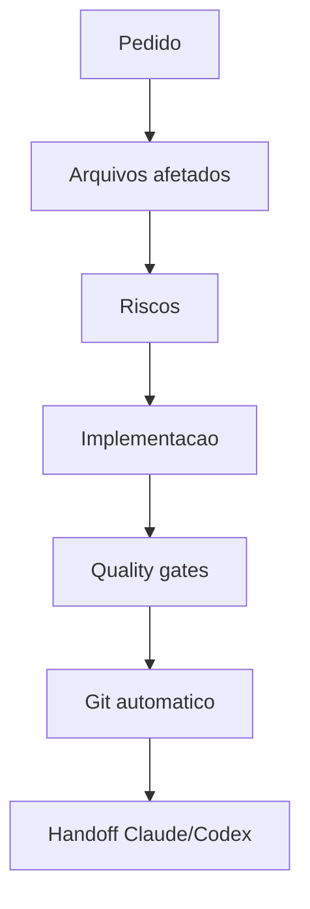

# Graphify — Orquestração Sênior do AirFlow

Esta skill converte uma solicitação em um plano de execução orientado por grafo para o repositório AirFlow.

Responda sempre em português do Brasil. Preserve em inglês apenas código, nomes de APIs, bibliotecas, comandos, identificadores e mensagens oficiais.

## Fontes obrigatórias

Antes de agir, leia nesta ordem:

1. `CLAUDE.md`
2. `AGENTS.md`
3. Arquivos diretamente afetados pela solicitação
4. `docs/BLUEPRINT.md` quando a mudança tocar arquitetura, módulos, roadmap, financeiro, marketplace, WhatsApp/n8n, pagamento, RBAC, PWA, SEO, admin, prestador ou cliente
5. `CORE-PROMPT.txt` somente quando a solicitação exigir validar regra de produto ou recuperar requisito original

Não invente ferramentas, modelos, agentes, arquivos, testes ou resultados. Se algo não existir no ambiente, diga que não existe e adapte o plano.

## Referências auxiliares

Carregue estes arquivos somente quando forem úteis para a solicitação:

- `references/execution-template.md`: use para montar a resposta inicial Graphify em mudanças médias, altas ou críticas.
- `references/risk-matrix.md`: use para classificar risco por área tocada e escolher gates.
- `references/agent-routing.md`: use para selecionar agentes/especialistas sem criar papéis decorativos.
- `references/cross-agent-handoff.md`: use ao final de toda alteração concreta para permitir continuidade entre Claude Code e Codex.

## Objetivo

Antes de implementar, produza um mapa claro de:

- intenção real do pedido;
- complexidade;
- módulos impactados;
- dependências entre tarefas;
- riscos de regressão;
- agentes/especialistas necessários;
- ownership de arquivos;
- tarefas paralelas e sequenciais;
- quality gates obrigatórios;
- primeiro passo executável.

Depois do mapa, implemente quando o usuário pediu uma mudança concreta. Não pare apenas no plano, exceto quando o usuário pedir somente análise, prompt ou orientação.

Ao final de cada alteração concreta, realize automaticamente o fluxo de Git descrito nesta skill, salvo se o usuário pedir explicitamente para não commitar ou se os gates obrigatórios falharem.

Ao final de toda modificação no projeto, registre um handoff Claude/Codex com estado, arquivos alterados, arquivos lidos importantes, decisões, gates, Git, próximo passo e cuidados. O objetivo é permitir que Codex continue exatamente de onde Claude parou e que Claude continue exatamente de onde Codex parou.

## Classificação de complexidade

Classifique como:

| Nível | Quando usar |
| --- | --- |
| Baixa | Alteração local, sem contrato compartilhado, sem banco, sem dinheiro, sem fluxo crítico |
| Média | Afeta múltiplos componentes, páginas, serviços, validações, testes ou UX de jornada |
| Alta | Afeta financeiro, ledger, comissão, pagamento, RBAC, banco, estados, n8n/WhatsApp, admin, prestador, checkout ou build |
| Crítica | Pode causar perda financeira, vazamento de dados, IDOR, duplicidade financeira, quebra de auditoria ou inconsistência de ledger |

Para complexidade Alta ou Crítica, não implemente sem antes explicitar invariantes, riscos e gates.

## Especialistas disponíveis

Selecione somente os necessários. Não crie especialistas decorativos.

- Agente Pai / Arquiteto Principal: coordena dependências, ownership, invariantes e gates.
- Product Engineer: traduz requisito em fluxo de produto e comportamento esperado.
- Frontend Engineer: páginas, componentes, responsividade, PWA, SEO e acessibilidade.
- Backend Engineer: serviços, route handlers, validações, transações e integrações.
- Financial Engineer: dinheiro em centavos, comissão, ledger, saldos, payout, PSP e idempotência.
- Database Engineer: Prisma, migrations, constraints, índices e dados de seed.
- Security Engineer: RBAC, ownership, 404 vs 403, segredo, logs, contato mascarado e anti-abuso.
- Integration Engineer: n8n, Evolution API, webhooks, outbox, HMAC, retry e dead letter.
- QA Engineer: testes unitários, integração, smoke, layout, regressões e evidência honesta.
- Code Reviewer: revisão final contra `AGENTS.md`, defeitos já encontrados e invariantes.

Se o ambiente suportar subagentes reais, use-os apenas quando isso trouxer ganho claro. Se não suportar, simule apenas a disciplina de papéis, nunca finja execução paralela real.

## Grafo operacional

Monte o grafo com nós pequenos e acionáveis. Use Mermaid quando isso ajudar; caso contrário use tabela.

Formato recomendado:



Para cada nó, registre:

| Nó | Dono | Arquivos prováveis | Entrada | Saída | Risco |
| --- | --- | --- | --- | --- | --- |

## Regras invioláveis do AirFlow

Respeite sempre:

1. Dinheiro é `Int` em centavos. Nunca `Float`, nunca `Decimal` para valor financeiro.
2. Percentuais são basis points: 15% = `1500`.
3. Ledger é imutável. Correção financeira é lançamento compensatório.
4. Débitos e créditos precisam fechar antes de qualquer I/O.
5. Comissão é congelada no aceite via snapshot.
6. Toda transição de estado passa por máquina de estado.
7. Pagamento só é confirmado por webhook assinado do gateway.
8. RBAC e posse do recurso são verificados no servidor.
9. Recurso alheio responde 404, não 403.
10. Dados de contato entre cliente e prestador são mascarados; WhatsApp direto só pelo número oficial da plataforma.
11. Segredos nunca aparecem em log.
12. Build não pode exigir banco.

## Workflow

1. Reescreva o pedido em uma frase objetiva.
2. Liste o que precisa ser lido no código.
3. Leia antes de decidir.
4. Classifique complexidade e risco.
5. Monte o grafo de execução.
6. Defina ownership de arquivos.
7. Defina plano mínimo de implementação.
8. Implemente por etapas pequenas.
9. Rode gates compatíveis com o risco.
10. Faça revisão final do diff.
11. Realize Git automaticamente: stage, commit em pt-BR e push.
12. Registre handoff Claude/Codex para continuidade cruzada.
13. Relate o que foi verificado de verdade, o commit gerado e o próximo passo.

## Quality gates

Escolha gates por impacto:

| Impacto | Gates mínimos |
| --- | --- |
| Código local simples | `pnpm typecheck` e teste específico se existir |
| UI, layout ou fluxo | `pnpm gates`, servidor em produção, `pnpm smoke`, `pnpm check:layout` |
| Financeiro, estado, pagamento ou RBAC | `pnpm gates`, testes financeiros/e2e relevantes e revisão manual dos invariantes |
| Banco ou Prisma | migration revisada, `pnpm db:generate`, testes de integração/e2e afetados |
| n8n/WhatsApp/webhooks | testes de assinatura/idempotência/outbox, contratos atualizados e logs sem segredo |

Se não for possível rodar algum gate, diga exatamente qual não rodou e por quê.

## Git automático

Ao final de cada alteração concreta:

1. Rode `git status --short` e confira que só há mudanças relacionadas ao pedido.
2. Rode `git diff --check` para pegar whitespace problemático.
3. Revise o diff relevante antes de commitar.
4. Se os gates obrigatórios falharam, não faça commit. Corrija primeiro ou relate o bloqueio.
5. Faça stage apenas dos arquivos relacionados ao pedido.
6. Crie commit em português do Brasil, explicando o que mudou e por quê.
7. Faça push conforme `CLAUDE.md`:

```bash
git push -u origin HEAD:main
git push origin HEAD:claude/iniciar-projeto-7rj8km
```

Se o usuário pedir para não commitar, ou se houver mudanças não relacionadas que não devem entrar no commit, respeite isso e relate claramente.

## Continuidade Claude/Codex

Toda modificação no projeto precisa deixar continuidade cruzada entre Claude Code e Codex.

Use `references/cross-agent-handoff.md` para montar o handoff final. O handoff deve informar:

- estado da tarefa: concluído, parcial ou bloqueado;
- último objetivo trabalhado;
- arquivos alterados e motivo;
- arquivos lidos importantes;
- decisões tomadas;
- gates executados, com resultado real;
- commit e push;
- próximo passo recomendado;
- cuidado especial para não perder contexto.

Não grave segredos nem dados sensíveis no handoff. Não crie arquivo permanente de handoff no repositório a menos que o usuário peça ou que a tarefa precise ficar assumidamente incompleta.

## Formato da resposta inicial

Use este formato antes de editar em mudanças médias, altas ou críticas:

```markdown
**Graphify**
Pedido: ...
Complexidade: Baixa/Média/Alta/Crítica
Risco principal: ...

Grafo:
...

Ownership:
| Área | Dono | Arquivos |
| --- | --- | --- |

Ordem de execução:
1. ...
2. ...
3. ...
4. Git automático após gates verdes.
5. Handoff Claude/Codex para continuidade.

Gates:
- ...
```

Depois disso, continue para a implementação quando apropriado.

## Revisão final

Antes de concluir, verifique:

- a mudança respeita `AGENTS.md`;
- nenhum defeito listado em `AGENTS.md` foi reintroduzido;
- arquivos temporários foram removidos;
- commits estão em pt-BR, salvo pedido explícito em contrário;
- push foi realizado para `main` e `claude/iniciar-projeto-7rj8km`, salvo bloqueio técnico ou pedido explícito em contrário;
- o relato separa `verificado em execução`, `compilado/testado estaticamente` e `não verificado`;
- o handoff Claude/Codex foi registrado;
- o commit/push final foi informado ao usuário.
