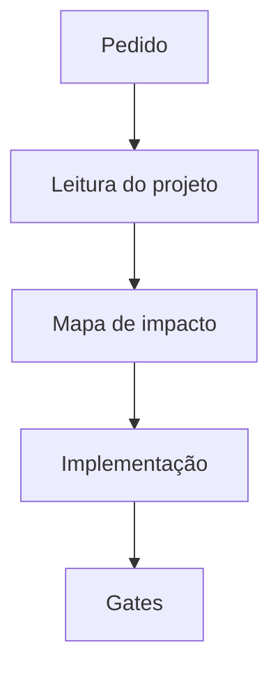

# Template de Execução Graphify

Use este template quando a mudança for média, alta ou crítica.

```markdown
**Graphify**
Pedido: <reescreva a solicitação em uma frase objetiva>
Complexidade: <Baixa | Média | Alta | Crítica>
Risco principal: <risco mais provável ou mais caro>

Grafo:


Ownership:
| Área | Dono | Arquivos prováveis |
| --- | --- | --- |
| Produto | Product Engineer | ... |
| Frontend | Frontend Engineer | ... |
| Backend | Backend Engineer | ... |
| Financeiro | Financial Engineer | ... |
| Segurança | Security Engineer | ... |
| QA | QA Engineer | ... |

Ordem de execução:
1. Ler `CLAUDE.md` e `AGENTS.md`.
2. Ler arquivos diretamente afetados.
3. Confirmar invariantes e contratos existentes.
4. Implementar menor fatia funcional.
5. Rodar gates compatíveis com o risco.
6. Relatar verificações reais e pendências.

Gates:
- <comandos exatos>
```

Remova áreas que não se aplicam. Não mantenha especialistas decorativos.
