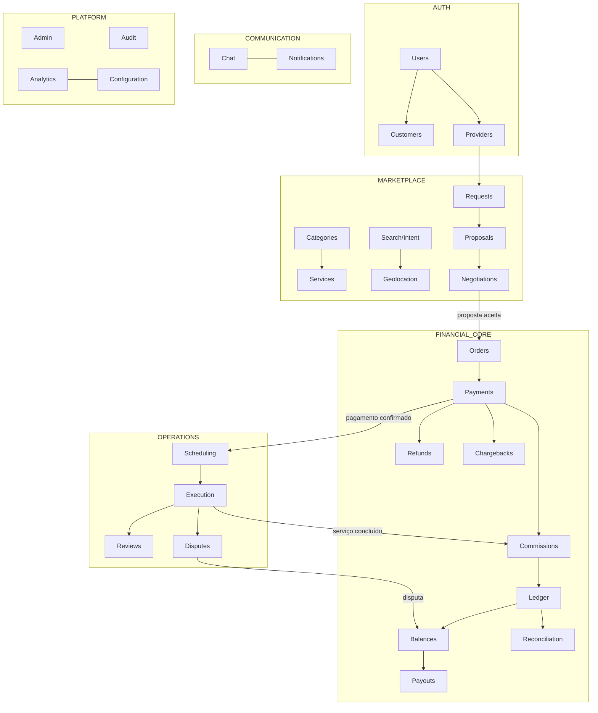
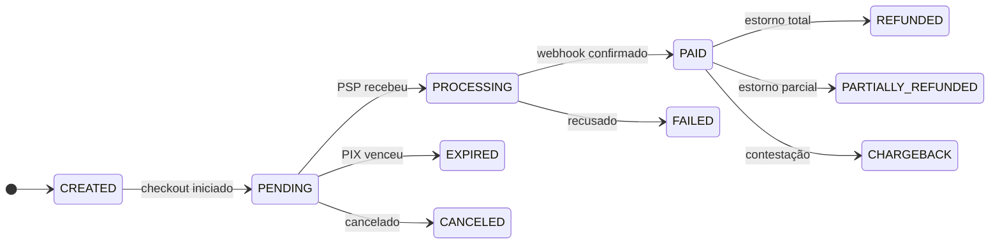
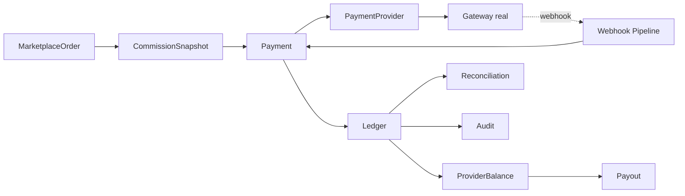

# Blueprint Técnico — Marketplace Transacional de Climatização

> Entrega obrigatória do §72 do `CORE-PROMPT.txt`.
> Documento vivo. Atualizado a cada fase concluída.

**Produto:** AirFlow — marketplace transacional que conecta clientes a técnicos de ar-condicionado, controlando todo o ciclo comercial dentro da plataforma (descoberta → contratação → pagamento → execução → comissão → repasse → reputação).

**Marca provisória:** o nome "AirFlow" foi herdado do nome do repositório (`airflow-webapp`). É uma decisão de marca reversível — não há acoplamento de código ao nome.

---

## 1. Diagnóstico da stack existente

Investigação do repositório no estado inicial (§67, Etapa 1):

| Item | Situação encontrada |
|---|---|
| Arquivos versionados | `CORE-PROMPT.txt` (spec, 2.423 linhas) e `README.md` (1 linha) |
| Commits | 2 (`Initial commit`, `prompt`) |
| Código-fonte | **Inexistente** |
| Stack pré-existente | **Nenhuma** — não há `package.json`, framework, banco ou build |
| Banco | Nenhum schema. PostgreSQL 16.13 disponível no ambiente |
| Autenticação | Inexistente |
| Design System | Inexistente |
| Infraestrutura | Nenhum IaC, Dockerfile ou pipeline CI |
| Integrações | Nenhuma |

**Conclusão:** projeto *greenfield*. Não há legado a preservar nem restrição de arquitetura herdada — todas as decisões abaixo são de primeira ordem, sem custo de migração.

### 1.1 Ambiente de execução verificado

Valores lidos do ambiente, não presumidos:

```
Node.js        v22.22.2
pnpm           10.33.0
PostgreSQL     16.13 (servidor local ativo; bancos airflow_dev e airflow_test criados)
CPU / RAM      4 vCPU / 16 GB
Registry npm   acessível
```

### 1.2 Disponibilidade real de ferramentas de orquestração

O `CORE-PROMPT.txt` solicita, na primeira linha, ativar a skill `/graphify` e uma skill de orquestração multiagente.

| Ferramenta pedida | Status real | Consequência |
|---|---|---|
| Skill `/graphify` | **NÃO DISPONÍVEL** no ambiente | Mapeamento de dependências e blast radius feito manualmente. Sem grafo, o risco é mitigado pela arquitetura em camadas (§3), que torna o blast radius estruturalmente previsível |
| Skill de orquestração multiagente | **NÃO INSTALADA** | Execução single-agent |
| Subagentes (Agent tool) | Disponíveis, porém **a política desta sessão proíbe acioná-los sem pedido explícito do usuário** | Execução single-agent com fases sequenciadas |

**Não é possível apresentar "Agente Pai / Agentes Filhos / modelo por agente / DAG de paralelização"** conforme §72, porque a orquestração multiagente não existe neste ambiente. Inventar essa seção seria violar o §2 ("não invente versões ou identificadores") e o §65 ("nunca invente resultados").

O que substitui a orquestração: o roadmap em fases da §24 deste documento, com *quality gates* reais executados por fase e ownership de arquivos definido pela fronteira de módulos.

**Modelo em execução:** `claude-opus-5` (identificador real do ambiente).

---

## 2. Arquitetura proposta

### 2.1 Stack selecionada

| Camada | Escolha | Justificativa |
|---|---|---|
| Framework | **Next.js 16.3** (App Router, Server Components, Route Handlers) | Um único runtime entrega SSR para SEO (§50), API server-side (§57) e shell de PWA (§46). Evita manter dois deploys |
| Linguagem | **TypeScript 5.9** `strict` | Estados e valores monetários são o núcleo do risco; tipagem forte é barreira de defeito |
| Banco | **PostgreSQL 16** | Transações ACID e constraints são requisito não-negociável do ledger (§21). `numeric`/`bigint` para dinheiro, índices compostos para geo/busca |
| ORM | **Prisma 7.9** | Migrations versionadas, enums nativos, transações interativas. Client TS-first |
| Estilo | **Tailwind CSS 4.3** + tokens próprios | Design system por tokens (§48) sem aparência de template |
| Validação | **Zod 4.4** | Um schema por contrato de API, validado *server-side* (§57) |
| Auth | **jose** (JWT) + **bcryptjs** | Sessão em cookie `httpOnly`; RBAC verificado no servidor (§5) |
| Testes | **Vitest 4.1** | Domínio puro testável sem banco; integração com Postgres real |

### 2.2 Princípio arquitetural central

> **O domínio financeiro não conhece HTTP, React, Prisma ou gateway.**

```
┌───────────────────────────────────────────────────────┐
│  src/app         Next.js — páginas e Route Handlers   │  ← I/O, HTTP, RSC
├───────────────────────────────────────────────────────┤
│  src/server      Serviços de aplicação, repositórios, │  ← orquestra transações
│                  auth, adapters de PSP                │
├───────────────────────────────────────────────────────┤
│  src/domain      Regras puras: money, comissão,       │  ← ZERO dependências
│                  ledger, máquinas de estado           │     de I/O
├───────────────────────────────────────────────────────┤
│  src/ui          Design System                        │
└───────────────────────────────────────────────────────┘
```

Dependências apontam **para dentro**. `src/domain` não importa nada de `src/server` ou `src/app`.

Consequência prática: os testes financeiros obrigatórios do §64 rodam em milissegundos, sem banco, sem rede e sem *fixtures* — o que torna viável executá-los em todo commit.

### 2.3 Estrutura de diretórios

```
prisma/            schema.prisma, migrations, seed
docs/              BLUEPRINT.md e documentação de arquitetura
src/
├── app/
│   ├── (public)/          home, busca, perfis, páginas SEO
│   ├── (auth)/            login, cadastro
│   ├── (cliente)/         dashboard do cliente
│   ├── (prestador)/       dashboard do prestador
│   ├── admin/             painel administrativo
│   └── api/               Route Handlers (REST) + webhooks
├── domain/
│   ├── shared/            money, result, erros, ids
│   ├── financial/         commission engine, ledger, balances
│   ├── marketplace/       ranking, matching, busca por intenção
│   └── state-machines/    as 10 máquinas do §52
├── server/
│   ├── auth/              sessão, RBAC, guards
│   ├── db/                cliente Prisma
│   ├── payments/          PaymentProvider + adapters
│   ├── services/          casos de uso transacionais
│   └── observability/     logs estruturados, correlation id
├── ui/                    Design System
└── lib/                   utilitários compartilhados
tests/
├── financial/             §64 — obrigatórios
├── domain/                unitários
└── e2e/                   §69 — fluxo ponta a ponta
```

---

## 3. Diagrama de domínios (§53)



**Regra de acoplamento:** `MARKETPLACE` publica o evento `ProposalAccepted`; o `FINANCIAL_CORE` reage criando a Order. O marketplace não sabe calcular comissão, e o financeiro não sabe negociar preço.

---

## 4. Mapa completo de páginas

### Público (indexável)
| Rota | Função |
|---|---|
| `/` | Homepage (§49) |
| `/tecnicos` | Busca — lista e mapa |
| `/tecnicos/[cidade]` | Landing SEO por cidade |
| `/tecnicos/[cidade]/[bairro]` | Landing SEO por bairro |
| `/tecnico/[slug]` | Perfil público do técnico (§9) |
| `/servicos` | Índice de categorias |
| `/servicos/[slug]` | Landing por serviço (limpeza, instalação, manutenção) |
| `/como-funciona`, `/seguranca`, `/faq` | Confiança e conversão |
| `/seja-prestador` | Aquisição de oferta |
| `/termos`, `/privacidade` | LGPD (§58) |
| `/sitemap.xml`, `/robots.txt` | SEO |

### Autenticação
`/entrar`, `/cadastrar`, `/cadastrar/prestador`, `/recuperar-senha`

### Cliente (§40)
`/app` · `/app/solicitar` (wizard) · `/app/solicitacoes` · `/app/solicitacoes/[id]` · `/app/servicos` · `/app/mensagens` · `/app/mensagens/[id]` · `/app/favoritos` · `/app/pagamentos` · `/app/historico` · `/app/avaliacoes` · `/app/enderecos` · `/app/perfil` · `/app/suporte` · `/app/checkout/[orderId]`

### Prestador (§41)
`/pro` · `/pro/onboarding/[etapa]` · `/pro/solicitacoes` · `/pro/propostas` · `/pro/negociacoes` · `/pro/agenda` · `/pro/servicos-ativos` · `/pro/mensagens` · `/pro/clientes` · `/pro/financeiro` · `/pro/financeiro/saldo` · `/pro/financeiro/repasses` · `/pro/avaliacoes` · `/pro/portfolio` · `/pro/meus-servicos` · `/pro/disponibilidade` · `/pro/area-atendimento` · `/pro/perfil`

### Admin (§42)
`/admin` · `/admin/clientes` · `/admin/prestadores` · `/admin/verificacoes` · `/admin/servicos` · `/admin/categorias` · `/admin/solicitacoes` · `/admin/propostas` · `/admin/ordens` · `/admin/pagamentos` · `/admin/comissoes` · `/admin/regras-comissao` · `/admin/ledger` · `/admin/saldos` · `/admin/repasses` · `/admin/estornos` · `/admin/chargebacks` · `/admin/disputas` · `/admin/avaliacoes` · `/admin/denuncias` · `/admin/cupons` · `/admin/regioes` · `/admin/notificacoes` · `/admin/auditoria` · `/admin/configuracoes` · `/admin/conciliacao`

---

## 5. Jornadas

**Cliente:** descobre (orgânico/SEO) → busca por serviço ou sintoma → filtra e compara → abre perfil → wizard de solicitação (serviço, equipamento, BTUs, fotos, endereço, data, valor proposto) → envia proposta → negocia → aceita valor → paga (PIX/cartão) → acompanha timeline → confirma conclusão → avalia.

**Prestador:** cadastra conta → onboarding em 11 etapas (§8) → aguarda análise → aprovado → recebe solicitações → aceita / contrapropõe / recusa → negocia → serviço autorizado após pagamento confirmado → agenda → executa (a caminho → em andamento → concluído) → aguarda janela de segurança → saldo liberado → solicita repasse.

**Admin:** monitora KPIs → analisa verificações → configura regras de comissão → audita ledger → media disputas → processa repasses → concilia com o PSP.

---

## 6. Modelo de dados

35 entidades do §51 implementadas em `prisma/schema.prisma`. Agrupamento:

- **Identidade:** `User`, `CustomerProfile`, `ProviderProfile`, `ProviderVerification`, `ProviderDocument`, `ProviderAvailability`, `Address`
- **Catálogo e demanda:** `ServiceCategory`, `ProviderService`, `ServiceRequest`, `RequestAttachment`, `Proposal`
- **Comunicação:** `Conversation`, `Message`, `Notification`
- **Operação:** `Appointment`, `Review`, `Favorite`, `Dispute`, `DisputeEvidence`
- **Financial Core:** `MarketplaceOrder`, `Payment`, `PaymentAttempt`, `PaymentEvent`, `CommissionRule`, `CommissionSnapshot`, `Commission`, `LedgerAccount`, `LedgerTransaction`, `LedgerEntry`, `ProviderBalance`, `Payout`, `Refund`, `Chargeback`, `ReconciliationRun`, `IdempotencyKey`
- **Plataforma:** `AuditLog`, `AnalyticsEvent`

### Decisões estruturais

1. **Dinheiro é `Int` em centavos.** Nunca `Float`, nunca `Decimal` na aplicação (§18). `R$ 300,00` → `30000`.
2. **`LedgerEntry` não tem `update` nem `delete`.** Correção gera transação reversa (§21).
3. **Soft delete** apenas onde há valor histórico não-financeiro (`deletedAt` em perfis e serviços). Registros financeiros nunca são apagados, nem logicamente.
4. **Unique constraints** contra corrida: `Payment.idempotencyKey`, `LedgerTransaction.idempotencyKey`, `PaymentEvent(provider, externalEventId)`, `Review.orderId` (uma avaliação por ordem), `Favorite(customerId, providerId)`.
5. **Índices** para os caminhos quentes: geo (`latitude, longitude`), busca (`cityId, categoryId, status`), agenda (`providerId, scheduledAt`), ledger (`accountId, createdAt`).

---

## 7. Máquinas de estado (§52)

Dez máquinas com transições validadas **no backend**, em `src/domain/state-machines`. Uma transição não declarada lança erro — não há caminho alternativo pela UI.



| Máquina | Estados |
|---|---|
| `Provider` | `INCOMPLETO → AGUARDANDO_ANALISE → APROVADO / REJEITADO → SUSPENSO / BLOQUEADO` |
| `ServiceRequest` | `RASCUNHO → ABERTA → EM_NEGOCIACAO → CONTRATADA → CANCELADA / EXPIRADA` |
| `Proposal` | `ENVIADA → CONTRAPROPOSTA → ACEITA / RECUSADA / EXPIRADA / RETIRADA` |
| `Order` | `CRIADA → AGUARDANDO_PAGAMENTO → PAGA → AUTORIZADA → EM_EXECUCAO → CONCLUIDA → LIQUIDADA / CANCELADA / EM_DISPUTA / ESTORNADA` |
| `Payment` | `CREATED → PENDING → PROCESSING → PAID / FAILED / EXPIRED / CANCELED → REFUNDED / PARTIALLY_REFUNDED / CHARGEBACK` |
| `Appointment` | `AGUARDANDO → CONFIRMADO → A_CAMINHO → EM_ANDAMENTO → CONCLUIDO / CANCELADO / EM_DISPUTA` |
| `Dispute` | `ABERTA → EM_ANALISE → AGUARDANDO_EVIDENCIA → RESOLVIDA_CLIENTE / RESOLVIDA_PRESTADOR / RESOLVIDA_PARCIAL / CANCELADA` |
| `Payout` | `REQUESTED → PROCESSING → PAID / FAILED / CANCELED` |
| `Refund` | `SOLICITADO → PROCESSANDO → CONCLUIDO / FALHOU` |
| `Negotiation` | derivada do histórico versionado de `Proposal` |

---

## 8. Arquitetura do Financial Core (§16)



### 8.1 Money
Inteiros em centavos. Operações em `src/domain/shared/money.ts`, incluindo `allocate()` para rateio sem perda de centavos — a soma das partes é sempre igual ao todo.

### 8.2 Commission Engine (§20)
Regras em *basis points* (bps): 15% = `1500` bps. Inteiro, sem ponto flutuante.

**Precedência** (primeira que casar vence):
```
PROVIDER (1) → PROMOTIONAL/CAMPAIGN (2) → CITY (3) → CATEGORY (4) → PLAN (5) → GLOBAL (6)
```
Empate no mesmo nível é resolvido por `priority` explícita e depois por `createdAt` mais recente. A resolução é determinística e o resultado registra **qual regra e qual versão** foram aplicadas — exigência direta do §20 e do §70.

### 8.3 Snapshot financeiro (§19)
No instante do aceite, congela: valor bruto, regra aplicada (id + **versão**), bps, taxa fixa, desconto, valor da comissão, valor líquido, moeda e timestamp. Alterar a regra global de 15% para 18% **não altera** nenhuma ordem já contratada — a ordem carrega sua própria verdade.

### 8.4 Ledger de partidas dobradas (§21)
`LedgerTransaction` agrupa N `LedgerEntry`. **Invariante:** soma dos débitos = soma dos créditos, validada no domínio antes de persistir. Contas:

```
PLATFORM_CASH          caixa da plataforma no PSP
PLATFORM_REVENUE       receita de comissão
CUSTOMER_ESCROW        valor retido do cliente até a liberação
PROVIDER_PAYABLE:<id>  a pagar ao prestador
GATEWAY_FEES           custo do PSP
REFUNDS_PAYABLE        estornos a executar
CHARGEBACK_LOSSES      perdas por contestação
```

### 8.5 Saldos segregados (§22)
`pending` · `available` · `blocked` · `inTransit`. Quatro campos distintos, cada um derivável do ledger — nunca um saldo único.

---

## 9. Fluxo pagamento → comissão → saldo → repasse (§17)

| # | Evento | Lançamentos no ledger |
|---|---|---|
| 1 | Proposta aceita | — (cria Order + Snapshot) |
| 2 | Pagamento confirmado (R$ 300) | D `PLATFORM_CASH` 30000 / C `CUSTOMER_ESCROW` 30000 |
| 3 | Serviço concluído + janela de segurança vencida sem disputa | D `CUSTOMER_ESCROW` 30000 / C `PLATFORM_REVENUE` 4500 · C `PROVIDER_PAYABLE:x` 25500 |
| 4 | Saldo liberado | `pending` → `available` (25500) |
| 5 | Repasse solicitado | `available` → `inTransit` |
| 6 | Repasse pago | D `PROVIDER_PAYABLE:x` 25500 / C `PLATFORM_CASH` 25500 |

Comissão de 15% sobre R$ 300 = R$ 45,00 (4500), líquido R$ 255,00 (25500). Em nenhum ponto o frontend calcula ou libera valores.

---

## 10. Estratégia de gateway (§23)

Interface `PaymentProvider` isolando o Financial Core do SDK:

```ts
interface PaymentProvider {
  readonly id: string
  createCharge(input: CreateChargeInput): Promise<ChargeResult>
  getCharge(externalId: string): Promise<ChargeStatus>
  refund(input: RefundInput): Promise<RefundResult>
  verifyWebhookSignature(raw: string, headers: Headers): boolean
  parseWebhook(raw: string): NormalizedPaymentEvent
}
```

**Adapter inicial:** `SandboxPaymentProvider` — simulador determinístico de PIX e cartão, usado em desenvolvimento e nos testes do §64. Ele existe para exercitar o pipeline real (assinatura, idempotência, webhook, ledger), **não** para substituir um PSP em produção. Trocar por Mercado Pago, Asaas, Pagar.me ou Stripe é implementar a mesma interface e registrar no factory — o núcleo financeiro não muda.

CVV nunca trafega nem é armazenado; cartão é tokenizado no PSP (§24).

---

## 11. Arquitetura de webhooks (§26)

```
GATEWAY → POST /api/webhooks/[provider]
   ↓ 1. lê corpo bruto (sem parse prévio)
   ↓ 2. valida assinatura HMAC (falha → 401, sem efeito)
   ↓ 3. INSERT em PaymentEvent (provider, externalEventId) UNIQUE
   ↓    → violação = evento repetido → 200 OK, zero efeito
   ↓ 4. persiste o payload cru para auditoria
   ↓ 5. processa em transação: Payment → Ledger → Order
   ↓ 6. emite evento de domínio → notificações
   ↓ 7. 200 OK
```

**Nunca confiar cegamente:** o webhook é gatilho, não verdade. Em pagamento de alto valor ou divergência, o estado é reconfirmado via `getCharge()` antes de creditar. Eventos fora de ordem são resolvidos por comparação de timestamp do PSP contra o estado atual — um evento antigo não regride um pagamento já confirmado.

---

## 12. Estratégia de idempotência (§27)

Três camadas:

1. **Chave de requisição:** header `Idempotency-Key` em criação de pagamento, repasse e estorno. Tabela `IdempotencyKey` com unique — repetição devolve a resposta original.
2. **Unicidade natural no banco:** `PaymentEvent(provider, externalEventId)` e `LedgerTransaction.idempotencyKey`. A garantia é do Postgres, não da aplicação.
3. **Guarda por estado:** transições validadas pela máquina de estado. Confirmar um `Payment` já `PAID` é *no-op*, não erro.

> Um evento repetido dez vezes produz exatamente um efeito financeiro.

## 13. Estratégia de conciliação (§32)

Job periódico compara registros internos com o extrato do PSP e grava `ReconciliationRun`, detectando: pagamento no PSP sem registro interno, pagamento interno sem correspondência, divergência de valor, webhook perdido, estorno não refletido e status inconsistente. Divergências viram pendências no `/admin/conciliacao` — **nunca ajuste automático de saldo**.

## 14. RBAC (§5)

Papéis: `CUSTOMER`, `PROVIDER`, `ADMIN`. Autorização no servidor em duas camadas:

1. **Papel** — o handler declara quem pode entrar.
2. **Propriedade do recurso** — o registro pertence ao solicitante? Um cliente autenticado não lê a ordem de outro cliente.

Esconder botão no frontend não é controle de acesso. Toda mutação financeira exige, além do papel, validação de estado e registro em `AuditLog`.

## 15. Chat e notificações (§15, §39)

Chat com persistência em `Message` e tipos discriminados: `TEXT`, `IMAGE`, `PROPOSAL`, `COUNTER_PROPOSAL`, `VALUE_ACCEPTED`, `PAYMENT`, `SCHEDULING`, `SERVICE_STARTED`, `SERVICE_COMPLETED`, `SYSTEM`. Notificações: `IN_APP` na fundação; `PUSH` (Web Push), `EMAIL` e `WHATSAPP` com adapters preparados e ativados quando as credenciais existirem.

**Estado real da entrega** — o chat está implementado e coberto por teste (`tests/e2e/chat.test.ts`, `src/server/services/message-service.ts`), mas **sem tempo real**: o envio faz `router.refresh()` e o destinatário vê a mensagem na próxima navegação. O SSE previsto aqui (`/api/chat/[id]/stream`) **não foi construído** — §15 pede tempo real "quando a infraestrutura permitir", e o polling/SSE fica para quando houver um runtime com conexões persistentes. O que está entregue: criação automática da conversa na primeira proposta, eventos do ciclo entrando no fio com o tipo certo, e guarda contra troca de dados de contato (`src/domain/messaging/contact-guard.ts`). Detalhes em `docs/INTERFACES.md`.

## 16. Geolocalização (§45)

Consentimento explícito antes de acessar a posição. Distância por Haversine em SQL com *bounding box* prévia por índice — sem PostGIS na fundação, com caminho de migração aberto caso o volume exija. **A localização exata do prestador nunca é exposta**: a busca retorna distância aproximada arredondada e o mapa público usa uma projeção visual determinística da região, sem latitude ou longitude operacional no navegador. Centroides reais de bairro podem substituir essa projeção quando houver uma fonte pública confiável.

## 17. PWA (§46)

`manifest.webmanifest`, ícones maskable, service worker próprio com estratégias por tipo de recurso (network-first para dados, cache-first para estáticos), fallback offline, `display: standalone` e prompt de instalação contextual (exibido após engajamento, não na primeira visita).

**Regra crítica:** rotas de pagamento e checkout **nunca** são servidas do cache.

## 18. SEO (§50)

SSR com HTML semântico, metadata por rota, canonical, Open Graph, `sitemap.xml` e `robots.txt` dinâmicos, JSON-LD (`LocalBusiness`, `Service`, `AggregateRating`, `BreadcrumbList`) e URLs amigáveis. Landings programáticas cidade × bairro × serviço só são indexadas quando há **conteúdo real e prestadores ativos** — evita thin content e canibalização.

## 19. Segurança e LGPD (§57, §58)

Senhas com bcrypt (custo 12), sessão JWT `httpOnly`+`SameSite=Lax`+`Secure`, validação Zod em toda entrada, ORM parametrizado contra injection, escape padrão do React contra XSS, rate limiting em auth/proposta/pagamento, upload com validação de tipo e tamanho, secrets fora do bundle e auditoria de operações críticas.

LGPD: consentimento granular registrado, minimização de dados, documentos sensíveis com acesso restrito e auditado, política de retenção, exportação e exclusão de dados mediante requisição (com preservação dos registros financeiros exigidos por lei).

## 20. Observabilidade (§59)

Logs estruturados em JSON com `correlationId` e `requestId` propagados por toda operação financeira. Toda entrada de ledger carrega o `correlationId` que a originou — de um centavo é possível voltar até a requisição HTTP que o moveu.

## 21. Analytics (§60)

Funil instrumentado em `AnalyticsEvent` com os 13 passos do §60, de `visitou_home` a `avaliou`, permitindo calcular conversão entre etapas.

## 22. Estratégia de testes (§63, §64)

| Camada | Escopo |
|---|---|
| **Unit** | Domínio puro: money, comissão, ledger, máquinas de estado |
| **Financial** | Os 23 cenários obrigatórios do §64 |
| **Integration** | Serviços com Postgres real |
| **E2E** | O fluxo completo do §69 |
| **Security** | Autorização entre papéis, RBAC, IDOR |

## 23. Roadmap (§68)

| Fase | Conteúdo | Estado |
|---|---|---|
| 0 | Blueprint | ✅ |
| 1 | Fundação: arquitetura, banco, auth, RBAC, Design System | 🚧 |
| 2 | Prestadores: onboarding, verificação, perfis, portfólio | ✅ onboarding documental, revisão, serviços e portfólio integrados ao perfil público |
| 3 | Marketplace: busca, filtros, mapa, ranking, favoritos | 🚧 busca, filtros, ranking e mapa aproximado prontos; faltam favoritos |
| 4 | Solicitações: wizard, propostas, negociação | 🚧 backend pronto; falta o wizard |
| 5 | Comunicação: chat, notificações | ⏳ |
| 6 | Financial Core completo | ✅ domínio, PSP abstraído, webhooks, idempotência, liquidação, repasse e conciliação. Falta job de retry e serviço de chargeback |
| 7 | Execução: agenda, status, acompanhamento | ✅ agenda operacional, ações do prestador, confirmação do cliente e acompanhamento |
| 8 | Confiança: avaliações, reputação, disputas | ⏳ |
| 9 | Admin | ⏳ |
| 10 | Crescimento: SEO, analytics, PWA, performance | ⏳ |
| 11 | Hardening | ⏳ |

**Desvio consciente da ordem do §68:** o núcleo do Financial Core (money, comissão, ledger, máquinas de estado) é construído já na Fase 1, antes do marketplace. Motivo: é o componente de maior risco e o mais caro de corrigir depois que houver dados reais. Construí-lo por último criaria exatamente a dívida técnica que o §74 manda evitar. Ele é domínio puro, então não depende de UI nem de banco para estar correto e testado.

## 24. Riscos técnicos

| Risco | Impacto | Mitigação |
|---|---|---|
| Duplicidade de crédito por webhook repetido | **Crítico** | Idempotência em 3 camadas (§12) + testes obrigatórios |
| Arredondamento de comissão perdendo centavos | Alto | Inteiros em centavos + `allocate()` + testes de invariante |
| Corrida em repasse (saque duplo) | **Crítico** | `SELECT ... FOR UPDATE` no saldo dentro da transação |
| Mudança de regra de comissão afetando contratos antigos | Alto | Snapshot imutável versionado |
| Prisma 7 e Next 16 são majors recentes | Médio | Versões fixadas; build e testes rodados a cada fase |
| Sem PSP real contratado | Médio | Abstração `PaymentProvider` + adapter sandbox; troca não toca o núcleo |
| Ausência de Graphify para blast radius | Baixo | Arquitetura em camadas com dependências apontando para dentro |

## 25. Critérios de aceitação

**Fundação (Fase 1)**
- [x] Migration aplicada em Postgres real com as 35+ entidades
- [x] `Money` sem ponto flutuante, com rateio que preserva o total
- [x] Commission Engine com precedência determinística e versionamento
- [x] Ledger recusando transação desbalanceada
- [x] Saldos segregados em 4 categorias
- [x] Máquinas de estado recusando transição inválida
- [x] Auth com hash seguro e RBAC verificado no servidor
- [x] Testes do §64 executando e passando
- [x] `typecheck`, `lint`, `test` e `build` executados de verdade

**Produto (§69)** — o fluxo ponta a ponta completo, da criação de conta à avaliação, é o critério final e **ainda não está atendido**; depende das Fases 2–8.

---

## 26. Quality Gates executados (§65)

Resultados reais da Fase 1, obtidos por execução — não estimados.

| Gate | Resultado | Evidência |
|---|---|---|
| FUNCIONAL | **APROVADO** | O fluxo ponta a ponta do §69 executa de verdade contra PostgreSQL (`tests/e2e/fluxo-completo.test.ts`). Falta a camada de UI das Fases 2–5 e 7–9 |
| ARQUITETURA | **APROVADO** | `src/domain` sem nenhuma dependência de I/O; verificado por inspeção de imports |
| BUILD | **APROVADO** | `next build` — 11 páginas geradas, sem erro |
| TYPECHECK | **APROVADO** | `tsc --noEmit` — zero erros |
| LINT | **APROVADO** | `eslint` — zero avisos |
| TESTES | **APROVADO** | Vitest — 106 testes, 7 arquivos, 100% de aprovação (inclui integração com PostgreSQL real) |
| SEGURANÇA | **PARCIAL** | Implementados: hash bcrypt custo 12, JWT httpOnly, RBAC server-side, validação Zod, rate limiting, ORM parametrizado. Não executado: varredura automatizada e teste de penetração |
| PERFORMANCE | **NÃO EXECUTADO** | Sem Lighthouse/Core Web Vitals medidos. Homepage é estática com revalidação horária |
| REGRESSÃO | **NÃO APLICÁVEL** | Primeira entrega — não há baseline anterior |
| QA | **PARCIAL** | Verificação de layout responsivo automatizada em 4 viewports (`pnpm check:layout`): sem rolagem horizontal. Sem QA manual de jornada completa |

### Testes financeiros do §64 — cobertura atual

| Cenário | Situação |
|---|---|
| Pagamento aprovado | ✅ E2E contra Postgres |
| Pagamento recusado | ✅ E2E — nenhum lançamento gerado |
| PIX expirado | ✅ E2E — ordem permanece sem pagamento |
| Webhook duplicado (10×) | ✅ E2E — um único efeito financeiro |
| Webhook atrasado / fora de ordem | ✅ E2E — não regride pagamento confirmado |
| Webhook com assinatura inválida | ✅ E2E — recusado sem efeito |
| Webhook de cobrança desconhecida | ✅ E2E |
| Comissão, snapshot, alteração posterior da regra | ✅ unitário + E2E |
| Precedência de regra (prestador × global) | ✅ E2E |
| Saldo pendente / disponível / bloqueado / em repasse | ✅ unitário + E2E |
| Idempotência de liquidação e de liberação | ✅ E2E — job repetido não credita em dobro |
| Concorrência (saque duplo simultâneo) | ✅ E2E — `Promise.allSettled`, um passa e um falha |
| Repasse e confirmação repetida | ✅ E2E — lançamento único |
| Falha de repasse | ✅ unitário — saldo volta a disponível |
| Estorno total e parcial | ✅ unitário (ledger) |
| Disputa e bloqueio de saldo | ✅ unitário |
| Conciliação — consistente e com divergência | ✅ E2E — divergência vira pendência, sem ajuste automático |
| Avaliação sem contratação / de terceiro / duplicada | ✅ E2E |
| Timeout e retry de PSP | ⏳ estrutura de `PaymentAttempt` pronta; falta o job de retry |
| Chargeback ponta a ponta | ⏳ modelado e com lançamento no ledger; falta o serviço |

**106 testes passando** em 7 arquivos. A distinção importa: o que está marcado
como coberto tem teste executando. O que está pendente tem modelo e desenho
prontos, mas **ainda não tem código nem teste** — e não conta como feito.

### Critério do §69 — atendido

O fluxo ponta a ponta é executado por `tests/e2e/fluxo-completo.test.ts`
contra PostgreSQL real, verificando o estado do banco, do ledger e dos saldos
em cada etapa:

```
solicitação → proposta R$ 250 → contraproposta R$ 320 → negociação R$ 280
→ aceite → order + snapshot (15% = R$ 42) → checkout PIX → webhook assinado
→ escrow → agendamento → a caminho → em andamento → concluído
→ liquidação (comissão R$ 42 / líquido R$ 238) → janela de 48h
→ saldo liberado → repasse → conciliação sem divergência → avaliação
```

Ao final, o teste confirma a invariante que fecha tudo: **o ledger soma zero**
e sobra no caixa exatamente a comissão de R$ 42,00.

O §70 tem teste próprio: partindo de um lançamento do ledger, o sistema
responde às 19 perguntas da regra de ouro.

**Regra de ouro financeira (§70)** — para cada centavo, o sistema deve responder às 19 perguntas. O modelo de dados foi desenhado para isso; a verificação será um relatório executável em `/admin/ledger`.
