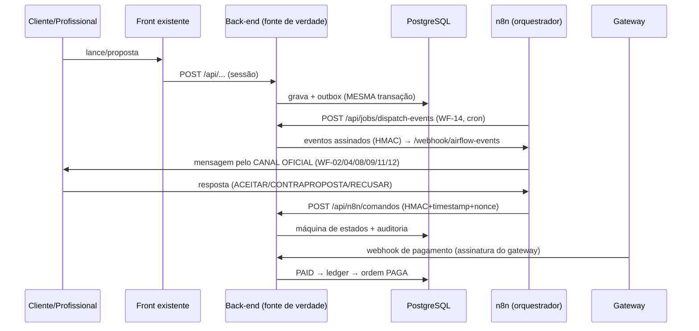

# Integração n8n — Negociação, Pagamentos, Comissão e Repasse

Instância: `https://n8n.hatclaw.run.place` — **apenas orquestrador**. O
back-end é a única fonte de verdade: toda transição passa pela máquina de
estados, toda mudança gera auditoria, e regra crítica nenhuma vive só no n8n.

## Plano de reúso (nada foi recriado)

| Capacidade | Implementação reutilizada |
|---|---|
| negotiations / proposals versionadas | `ServiceRequest` + `Proposal` (autor, valor, timestamp, versão, status, encadeamento — nunca sobrescreve) |
| payments / payment_events | `Payment`, `PaymentAttempt`, `PaymentEvent(provider, externalEventId) UNIQUE` |
| Registro do pagamento ANTES do gateway | `createCheckout` (já era assim) |
| Confirmação só por webhook assinado | `processWebhook`: assinatura → evento idempotente → descarte fora de ordem → reconfirmação ativa no PSP |
| Comissão configurável | `CommissionRule` (percentual, fixa, categoria, cidade, por profissional, min, max) + `CommissionSnapshot` imutável |
| Retenção / repasse | Saldos segregados `pending/available/blocked/inTransit` + janela de segurança + `Payout` com lock de linha |
| Disputas, auditoria, conciliação | `Dispute`, `AuditLog` (append-only, `correlationId`), `runReconciliation` |
| Idempotência | uniques no banco + `IdempotencyKey` |

**Única tabela nova:** `outbound_events` (outbox). Novos serviços apenas onde
não havia: recusa de proposta, conclusão em 2 passos, disputa (abrir/resolver),
risk score.

## Mapa de estados (tarefa → sistema)

| Estado pedido | Onde vive |
|---|---|
| AGUARDANDO_RESPOSTA | `Proposal ENVIADA` |
| CONTRAPROPOSTA_ENVIADA | nova `Proposal` versão N (anterior vira `CONTRAPROPOSTA`) |
| AGUARDANDO_CLIENTE / AGUARDANDO_PROFISSIONAL | derivado do autor da última proposta (turno alternado obrigatório) |
| PROPOSTA_ACEITA / PROPOSTA_RECUSADA | `Proposal ACEITA / RECUSADA` |
| AGUARDANDO_PAGAMENTO | `Order AGUARDANDO_PAGAMENTO` |
| PAGAMENTO_PROCESSANDO / CONFIRMADO | `Payment PROCESSING / PAID` (+ `Order PAGA`) |
| SERVICO_LIBERADO | `Order AUTORIZADA` — **`scheduleService` recusa ordem não paga (bloqueio no back-end)** |
| SERVICO_EM_ANDAMENTO | `Order EM_EXECUCAO` |
| AGUARDANDO_CONFIRMACAO_CONCLUSAO | `Appointment CONCLUIDO` com `Order EM_EXECUCAO` (profissional solicitou; cliente ainda não confirmou) |
| SERVICO_CONCLUIDO | `Order CONCLUIDA` (só com confirmação do cliente) |
| DISPUTA_ABERTA | `Order EM_DISPUTA` + `Dispute ABERTA` (bloqueia saldo automaticamente) |
| REPASSE_BLOQUEADO | `pendingCents` (janela de segurança) ou `blockedCents` (disputa) |
| REPASSE_PROCESSANDO / REALIZADO | `Payout PROCESSING / PAID` |
| CANCELADO | `Order CANCELADA` |
| MANUAL_REVIEW | bloqueio antifraude no repasse (`PAYOUT_RISK_BLOCKED` na auditoria) |

## Eventos (backend → n8n)

Envelope: `{event_id, event_type, event_version:"1.0", created_at, correlation_id, idempotency_key, source:"backend", data}` —
assinado com `HMAC-SHA256(timestamp + "." + body, N8N_WEBHOOK_SECRET)` nos
headers `x-airflow-signature` / `x-airflow-timestamp`.

`proposal.created|countered|accepted|rejected`, `negotiation.completed`,
`payment.requested|created|confirmed|failed`, `service.released|started|completed_requested|completed`,
`dispute.created|resolved`, `payout.requested|processing|completed|failed`, `review.requested`.

Payloads carregam **apenas ids e valores** — nunca telefone, e-mail ou
endereço. O endereço completo só sai na consulta sanitizada
(`GET /api/n8n/negociacoes/:id`) depois de `SERVICO_LIBERADO`.

Entrega via outbox: gravado na mesma transação da mudança de estado; retry
imediato, +30s, +2min, +10min, +30min; depois `DEAD_LETTER` (visível para
tratamento manual). Perder o n8n atrasa mensagens — nunca corrompe estado.

## Comandos (n8n → backend)

`POST /api/n8n/comandos` — headers `x-n8n-signature` (HMAC-SHA256 de
`timestamp.nonce.body` com `BACKEND_WEBHOOK_SECRET`), `x-n8n-timestamp`
(janela de 300 s) e `x-n8n-nonce` (unique no banco → replay recusado). Corpo
sempre com `idempotency_key`: repetição devolve a resposta original.

Comandos: `proposta.responder` (ACEITAR/CONTRAPROPOSTA/RECUSAR),
`pagamento.criar`, `ordem.agendar|iniciar|solicitar_conclusao|confirmar_conclusao`,
`disputa.abrir|resolver`, `repasse.processar|concluir|falhar`.

Jobs autenticados no mesmo esquema: `POST /api/jobs/dispatch-events` (WF-14) e
`POST /api/jobs/reconciliar` (WF-15).

## Workflows (infra/n8n/workflows/*.json)

WF-01 recebe todos os eventos e roteia por `event_type`; WF-02 envia a
proposta ao profissional pelo **número oficial**; WF-03/04 interpretam
respostas e viram comandos; WF-05 centraliza transições operacionais; WF-06
gera cobrança; WF-07 repassa webhook do gateway ao endpoint oficial; WF-08
notifica a liberação; WF-09 pede confirmação de conclusão ao cliente; WF-10
conduz o repasse; WF-11 pede avaliação; WF-12 disputas; WF-13 error-workflow
global; WF-14 cron do outbox; WF-15 conciliação.

Importação: n8n → *Import from file* para cada JSON; defina o WF-13 como
error workflow padrão da instância; ative os crons WF-14/15.

## Credenciais e variáveis que VOCÊ precisa preencher

**No backend (`.env`)** — placeholders em `.env.example`:
`N8N_BASE_URL`, `N8N_WEBHOOK_URL` (= `<N8N_BASE_URL>/webhook/airflow-events`),
`N8N_WEBHOOK_SECRET`, `BACKEND_WEBHOOK_SECRET` (32+ bytes aleatórios cada;
gere com `openssl rand -hex 32`).

**No n8n (Settings → Variables/Env)**:
`BACKEND_BASE_URL` (URL pública do backend), `N8N_BASE_URL`,
`N8N_WEBHOOK_SECRET` e `BACKEND_WEBHOOK_SECRET` (os MESMOS do backend),
`PAYMENT_PROVIDER_ID` (ex.: `sandbox`), `WHATSAPP_API_URL`,
`WHATSAPP_API_TOKEN`, `WHATSAPP_OFFICIAL_NUMBER` (número oficial da
plataforma — nunca números pessoais), `ALERTS_WEBHOOK_URL` (WF-13). Os code
nodes usam `require('crypto')`: mantenha `NODE_FUNCTION_ALLOW_BUILTIN=crypto`
na instância.

**No gateway real** (quando contratado): credenciais no adapter que
implementa `PaymentProvider`, segredo do webhook e URL de callback apontando
para `POST /api/webhooks/<provider>`. Nenhum segredo vai nos JSONs dos
workflows nem no repositório.

## Decisões registradas

1. **Quem chama o gateway é o backend** (via `PaymentProvider`), disparado
   pelo comando do WF-06 — preserva "registro antes do gateway", a abstração
   de fornecedor e a fonte de verdade. O n8n orquestra, não paga.
2. **Taxa do gateway**: `gatewayFeeCents` é capturada e auditável; hoje a
   plataforma a absorve (líquido = bruto − comissão). Repassá-la ao
   profissional é mudança de política comercial — o dado já existe para isso.
3. **Conciliação** compara interno × registros do PSP capturados; divergência
   vira pendência administrativa, nunca ajuste automático de saldo.
